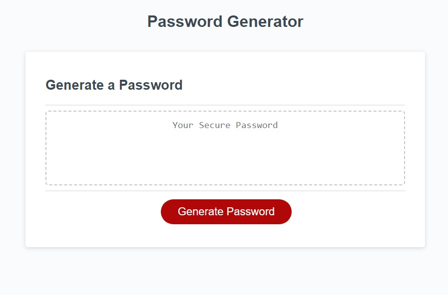

# Weekly Challenge 03 Create Password Generator Using Javascript

## URL to Portfolio

https://greg4949.github.io/challenge-week-3/

## Description

The purpose of this project was to create a web based random password generator using javascript.

## Installation

N/A

## Usage

Password generator can be accessed at the URL listed at the top of the README.  Clicking the generate password button will trigger a series of prompts for user to define their password criteria.
Once prompts have received input from user, the randomly generated password will display the password in a text box for the user to be able to see.

## Credits

N/A

## License

Please refer to the LICENSE in the repo.
